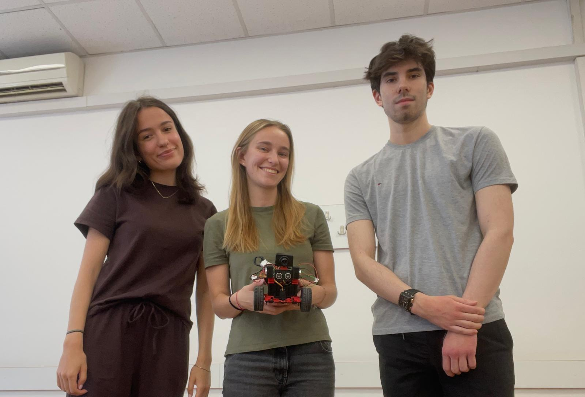
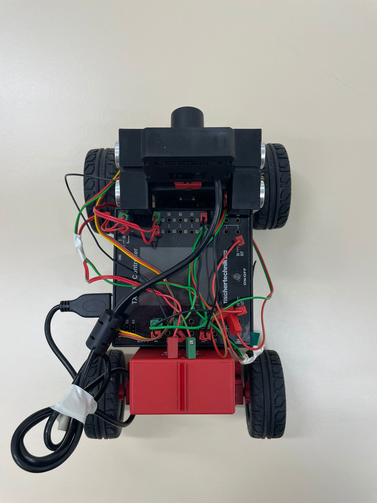
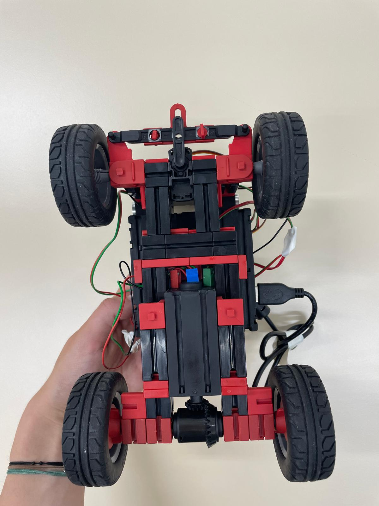
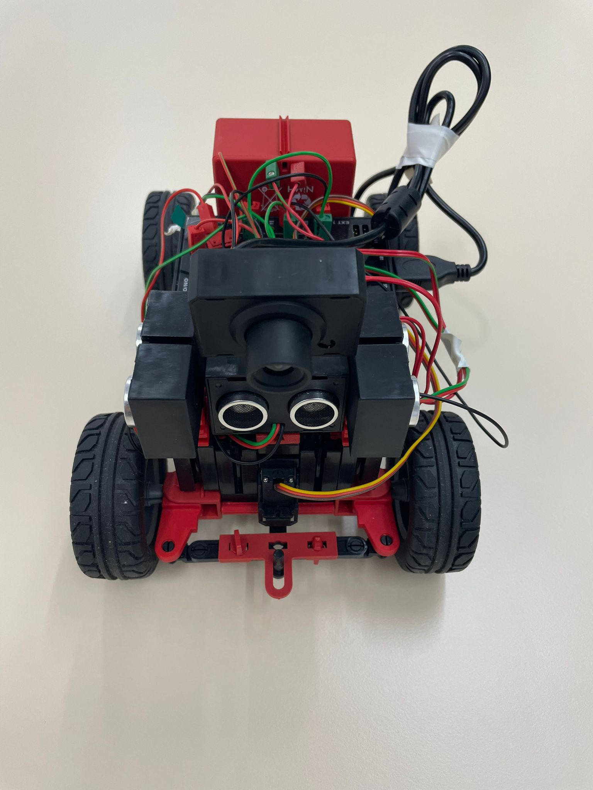
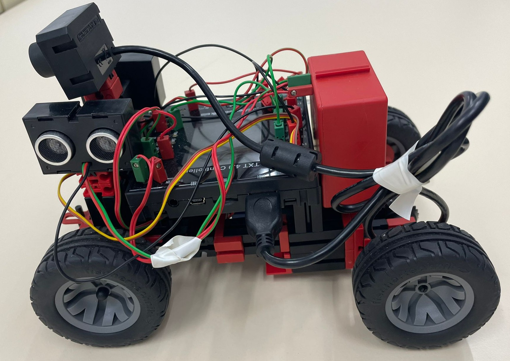
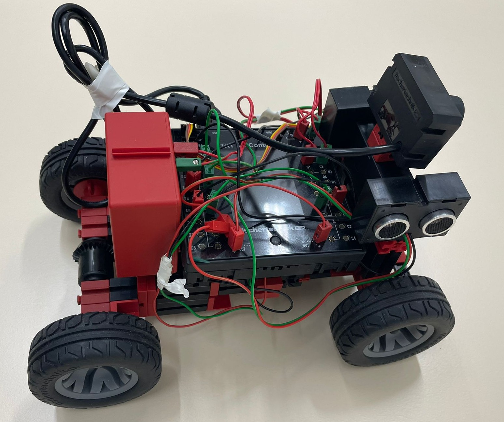
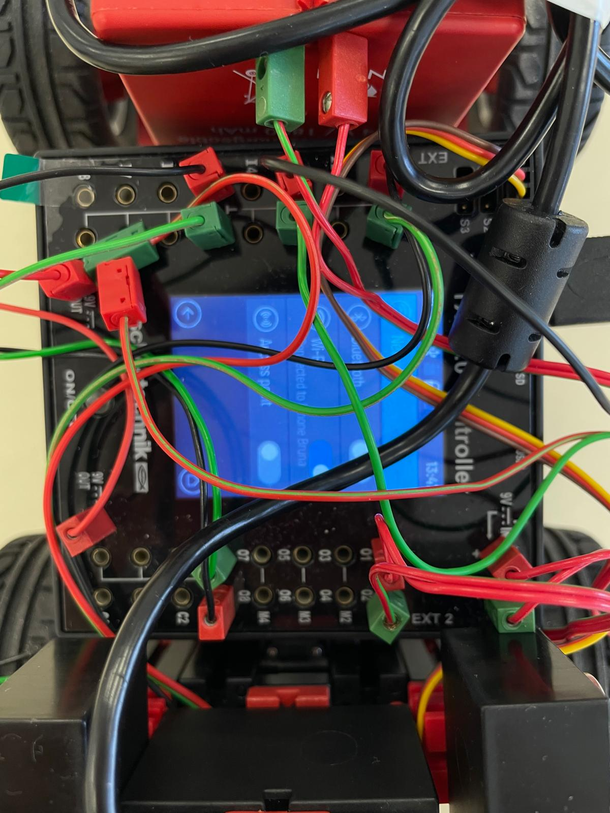

# WRO FUTURE ENGINEERS 2025: Team F2er


## Pictures - Team and vehicle

### Team
Team information:

•	Name: F2er

•	Members: Ana Petrović, Bruna Vlatković, Patrik Vranješ

•	Organization: Faculty of Electrical Engineering and Computing

•	Country: Zagreb, Croatia

<p align="center">
  
</p>


### Vehicle 

The vehicle is built using the `fischertechink STEM Coding Competition Robot Kit`. 

<p align="center">
  
  
  
  <br/>
  
  
  
</p>


## Performance Videos

The videos are public and posted on YouTube.

1) Open Challenge: 

2) Obstacle Challenge: 


## GitHub utilization
Our repository is on the following link: https://github.com/orgs/F2er-WRO/repositories

It includes the codes for the robot setup such as camera, controller and display. Two codes for the upload and run process, as well as the `open_challenge.py` and `obstacle_challenge.py`. 

Lastly, the repository includes the README.md file suitable with the following rules of the WRO Organization. 


## Build, Compile and Upload Process

The project was developed using **Python** as the programming language. All source code was written and edited using `Visual Studio Code (VS Code)`.

To connect and control the robot remotely, we used the `paramiko` package, which allowed us to access the TXT 4.0 controller via SSH. 

To make this work, we connected both the robot and our laptop to the same mobile hotspot, so they were on the same network. This was necessary because we had to include **the controller’s IP address** in the code. 

During the early stages of development, we tested our code by running scripts directly through the command line (using *python scripts/upload_and_run.py*). 

To start the robot in a way the rules of the competition provide, we followed these steps:

1. In VS Code, after writing and saving the Python files, connect to the robot using the **"Upload and Run File"** option to transfer the Python script to the controller and start execution.
2. The robot will automatically begin executing the code once the upload completes and by clicking the run button on its interface.

### Additional Python Libraries Used:
- `opencv-python` – for image processing and color detection
- `numpy` – for numerical operations and array handling
- `fischertechnik` – to communicate with motors, servos, and sensors

## Mobility Management 
We decided to use the official `fischertechnik STEM Coding Competition kit`, which was specifically developed for this "Future Engineers" competition category of the World Robot Olympiad. The base was assembled strictly following the official step-by-step instructions provided in the manual, ensuring stable construction, proper wheel alignment, and optimal weight distribution.

The drive motor is initialized using the encoder motor factory. Additionally, a motor step counter is created and linked to the encoder motor to track the number of steps taken during movement. 

The steering mechanism is controlled by a separate servomotor **Micro Servo 4.8/6V**, which allows the robot to adjust its direction in real time based on obstacle detection and navigation logic.

We began assembling the robot by constructing the lower base frame using red and black structural blocks, followed by adding the rear wheels with axle holders and spacers for stability. Next, we installed the encoder motor to complete the drive system. 

The front steering mechanism is supported by the Micro Servo. The front wheels were then attached to the steering links, completing the basic mobility structure. 

Afterwards, we positioned the **TXT 4.0 controller** on top of the base frame and connected all cables from the sensors, motor, camera, and servo to the corresponding ports.

At the start of the program, we initialize all the hardware components using the official `fischertechnik` Python library. These include the controller, sensors, motors, camera, and counters.

```python
txt_factory.init()
txt_factory.init_input_factory()
txt_factory.init_motor_factory()
txt_factory.init_servomotor_factory()
txt_factory.init_counter_factory()
txt_factory.init_usb_factory()
txt_factory.init_camera_factory()
```

## Power and Sense Management

The robot is powered by an **8.4V 1800mAh NiMH battery pack** with short circuit protection, recharged using the standard charger from the robot kit introduced earlier.

The robot has **three ultrasonic sensors**, each connected to a different port: ***I1 (front), I5 (right), and I3 (left)***. 

Each sensor consists of a dual transducer that sends and receives ultrasonic pulses, enabling accurate distance calculations in real time. The sensors were securely connected using the standard plug-and-cable system provided in the kit, following the official `fischertechnik` assembly guidelines. 

Their placement was chosen to provide full coverage on three sides of the robot, ensuring it can orient itself within confined environments and react to dynamic obstacles.


## Obstacle Detection
### Step-Based Turning Logic

For the Open Challenge, our idea was to let the robot check the distances from the left and right sensors, compare them, and choose **the smaller one which means the robot is closer to the inner wall on that side**. Then it adjusts its path to go around that side.

We spent time testing and adjusting values like driving speed, turning speed, and how sharp the turns are, to make everything run smoothly. 

We implemented step-based turning logic using **a counter variable** to track the number of completed turns. The robot continuously evaluates distances using its left and right ultrasonic sensors. 

When it detects a corner, it triggers a turning function `turn_left()` or `turn_right()` that uses the servomotor for steering and the encoder motor for movement. This modular approach allows the robot to navigate around the central box by following walls and turning only when necessary.

```python
def skreni_lijevo():
    print("Skrecem lijevo za 90")
    print(TXT_M_I3_ultrasonic_distance_meter.get_distance())
    TXT_M_M1_encodermotor.set_speed(150, TXT_M_M1_encodermotor.CCW)
    TXT_M_S1_servomotor.set_position(350)  #sharp left
    #TXT_M_M1_encodermotor.start()
    time.sleep(2)  # drive to the right
    #TXT_M_M1_encodermotor.stop()
    TXT_M_S1_servomotor.set_position(200)  #puts wheels back to the straight position
    time.sleep(0.2)
    while(TXT_M_I3_ultrasonic_distance_meter.get_distance()>50):
       time.sleep(0.5)
       print("ravno ", TXT_M_I3_ultrasonic_distance_meter.get_distance())
       TXT_M_M1_encodermotor.set_speed(260, TXT_M_M1_encodermotor.CCW)
    print("zid ", TXT_M_I3_ultrasonic_distance_meter.get_distance())
```

We than used the counter to measure when **three full laps** have been completed. When it reaches 13, it stops at the starting point.

```python
while (counter < 13):
    if lijevo == 0:
        if TXT_M_I5_ultrasonic_distance_meter.get_distance() > 50:
            skreni_desno()
            counter=counter + 1
    if lijevo == 1:
        if TXT_M_I3_ultrasonic_distance_meter.get_distance() > 50:
            skreni_lijevo()
            counter=counter + 1
```

### Camera and Color Detection

In this project, we used the `OpenCV library` for computer vision to detect obstacles of specific colors and to measure their height within the camera frame.

Before detecting the color, we convert each frame from the default **BGR (Blue, Green, Red)** format to the **HSV (Hue, Saturation, Value)** color space. This improves color detection accuracy under different lighting conditions by separating color (hue) from brightness (value). This way we made sure that the color detection does not depend on the brightness and lighting in the room. 

We define specific HSV value ranges for detecting **red** and **green** regions. Red is split into two ranges due to its position at both ends of the hue spectrum:

```python
RED_LOWER1 = np.array([0, 70, 50])
RED_UPPER1 = np.array([10, 255, 255])
RED_LOWER2 = np.array([170, 70, 50])
RED_UPPER2 = np.array([180, 255, 255])

GREEN_LOWER = np.array([40, 70, 50])
GREEN_UPPER = np.array([80, 255, 255])
```

After, we split the frame the camera sees into three parts, left, right and center.

The `max_height()` function calculates the height of the tallest detected colored object by finding external contours in the mask. It returns `h` which is the maximum bounding rectangle height in that area.

Combining the HSV value of red and green and the height of the shape the camera sees, we counted **the number of pixels**. We used this logic to determine which obstacle is the closest to the robot, meaning the bigger number of pixels of a certain color point to the traffic sign in front of the camera. 

```python
def zaobidji_prepreku(frame, boje):
    hsv = cv2.cvtColor(frame, cv2.COLOR_BGR2HSV)
    red_mask1 = cv2.inRange(hsv, RED_LOWER1, RED_UPPER1)
    red_mask2 = cv2.inRange(hsv, RED_LOWER2, RED_UPPER2)
    red_mask = cv2.bitwise_or(red_mask1, red_mask2)
    green_mask = cv2.inRange(hsv, GREEN_LOWER, GREEN_UPPER)
    
    hr=max_height(red_mask)
    hg=max_height(green_mask)
    print("crvena i zelena visina ", hr, hg)
    boja_blizu = "unknown"
    if hr > hg and hr > 0:
        boja_blizu='red'
    elif hg > 0:
        boja_blizu= "green"
    
    print("Najbliza prepreka:", boja_blizu)
```

In the Obstacle Challenge, we decided to start from a parallel parking position. The robot first moves backward until there's enough space, then turns left to exit the parking spot. 
